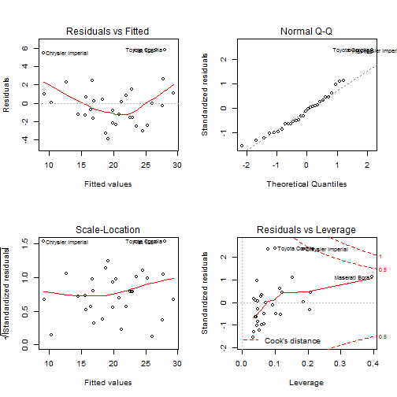

Shiny Project Pitch
========================================================
author: Mahesh Swaminathan
date: 3/31/2017
autosize: true

Summary
========================================================

My Shiny app allows a user to select features to regress against  miles per gallon (mpg) in the mtcars dataset. 

- Inputs: A combination of weight (wt), horsepower (hp), and transmission type (am)
- Outputs: Goodness of fit plots and a summary table for each selection set


The mtcars dataset
========================================================


```r
summary(mtcars)
```

```
      mpg             cyl             disp             hp       
 Min.   :10.40   Min.   :4.000   Min.   : 71.1   Min.   : 52.0  
 1st Qu.:15.43   1st Qu.:4.000   1st Qu.:120.8   1st Qu.: 96.5  
 Median :19.20   Median :6.000   Median :196.3   Median :123.0  
 Mean   :20.09   Mean   :6.188   Mean   :230.7   Mean   :146.7  
 3rd Qu.:22.80   3rd Qu.:8.000   3rd Qu.:326.0   3rd Qu.:180.0  
 Max.   :33.90   Max.   :8.000   Max.   :472.0   Max.   :335.0  
      drat             wt             qsec             vs        
 Min.   :2.760   Min.   :1.513   Min.   :14.50   Min.   :0.0000  
 1st Qu.:3.080   1st Qu.:2.581   1st Qu.:16.89   1st Qu.:0.0000  
 Median :3.695   Median :3.325   Median :17.71   Median :0.0000  
 Mean   :3.597   Mean   :3.217   Mean   :17.85   Mean   :0.4375  
 3rd Qu.:3.920   3rd Qu.:3.610   3rd Qu.:18.90   3rd Qu.:1.0000  
 Max.   :4.930   Max.   :5.424   Max.   :22.90   Max.   :1.0000  
       am              gear            carb      
 Min.   :0.0000   Min.   :3.000   Min.   :1.000  
 1st Qu.:0.0000   1st Qu.:3.000   1st Qu.:2.000  
 Median :0.0000   Median :4.000   Median :2.000  
 Mean   :0.4062   Mean   :3.688   Mean   :2.812  
 3rd Qu.:1.0000   3rd Qu.:4.000   3rd Qu.:4.000  
 Max.   :1.0000   Max.   :5.000   Max.   :8.000  
```

Plot of mpg regressed against weight and horsepower
========================================================


```r
fit <- lm(data=mtcars, mpg ~ wt + hp)

par(mfrow=c(2,2)); plot(fit); par(mfrow=c(1,1))
```


Summary of fit of mpg against wt and hp
========================================================


```r
summary(fit)$coef
```

```
               Estimate Std. Error   t value     Pr(>|t|)
(Intercept) 37.22727012 1.59878754 23.284689 2.565459e-20
wt          -3.87783074 0.63273349 -6.128695 1.119647e-06
hp          -0.03177295 0.00902971 -3.518712 1.451229e-03
```

```r
confint(fit)
```

```
                  2.5 %      97.5 %
(Intercept) 33.95738245 40.49715778
wt          -5.17191604 -2.58374544
hp          -0.05024078 -0.01330512
```
